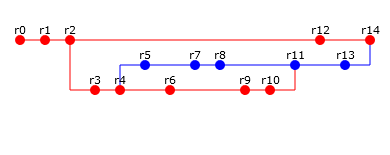

# Лабораторная работа №1 #

**Вариант №1104** 

Общественный городской транспорт Санкт-Петербурга. Полезная информация о всех видах городского транспорта, расписания, маршруты, тарифы, интерактивные сервисы - http://www.transportspb.com/

Составить список требований, предъявляемых к разрабатываемому веб-сайту (в соответствии с вариантом). Требования должны делиться на следующие категории:

- Функциональные.
    - Требования пользователей сайта.
    - Требования владельцев сайта.
- Нефункциональные.

Требования необходимо оформить в соответствии с шаблонами RUP (документ SRS - Software Requirements Specification). Для каждого из требований нужно указать его атрибуты (в соответствии с методологией RUP), а также оценить и аргументировать приблизительное количество часов, требующихся на реализацию этого требования.

Для функциональных требований нужно составить UML UseCase-диаграммы, описывающие реализующие их прецеденты использования.

# Лабораторная работа №2 #

**Вариант №1167**  

Сконфигурировать в своём домашнем каталоге репозитории svn и git и загрузить в них начальную ревизию файлов с исходными кодами (в соответствии с выданным вариантом).

Воспроизвести последовательность команд для систем контроля версий svn и git, осуществляющих операции над исходным кодом, приведённые на блок-схеме.

При составлении последовательности команд необходимо учитывать следующие условия:
- Цвет элементов схемы указывает на пользователя, совершившего действие (красный - первый, синий - второй).
- Цифры над узлами - номер ревизии. Ревизии создаются последовательно.
- Необходимо разрешать конфликты между версиями, если они возникают.

# Лабораторная работа №3 #

**Вариант №1387**

Написать сценарий для утилиты Apache Ant, реализующий компиляцию, тестирование и упаковку в jar-архив кода проекта из лабораторной работы №3 по дисциплине "Программирование интернет-приложений".

Каждый этап должен быть выделен в отдельный блок сценария; все переменные и константы, используемые в сценарии, должны быть вынесены в отдельный файл параметров; MANIFEST.MF должен содержать информацию о версии и о запускаемом классе.

**Cценарий должен реализовывать следующие цели (targets):**

1. **compile** - компиляция исходных кодов проекта.
2. **build** - компиляция исходных кодов проекта и их упаковка в исполняемый jar-архив. Компиляцию исходных кодов реализовать посредством вызова цели compile.
3. **clean** - удаление скомпилированных классов проекта и всех временных файлов (если они есть).
4. **test** - запуск junit-тестов проекта. Перед запуском тестов необходимо осуществить сборку проекта (цель build).
5. **scp** - перемещение собранного проекта по scp на выбранный сервер по завершению сборки. Предварительно необходимо выполнить сборку проекта (цель build)
6. **alt** - создаёт альтернативную версию программы с измененными именами переменных и классов (используя задание replace/replaceregexp в файлах параметров) и упаковывает её в jar-архив. Для создания jar-архива использует цель build.

# Лабораторная работа №4 #

**Вариант №1413**

1. Для своей программы из лабораторной работы #4 по дисциплине "Программирование интернет-приложений" реализовать:

    - MBean, считающий общее число установленных пользователем точек, а также число точек, попадающих в область. В случае, если количество установленных пользователем точек стало кратно 10, разработанный MBean должен отправлять оповещение об этом событии.
    - MBean, определяющий площадь получившейся фигуры.

2. С помощью утилиты JConsole провести мониторинг программы:

    - Снять показания MBean-классов, разработанных в ходе выполнения задания 1.
    - Определить значение переменной classpath для данной JVM.

3. С помощью утилиты VisualVM провести мониторинг и профилирование программы:

    - Снять график изменения показаний MBean-классов, разработанных в ходе выполнения задания 1, с течением времени.
    - Определить имя потока, потребляющего наибольший процент времени CPU.

4. Получить HeapDump, и с помощью утилиты VisualVM локализовать и устранить "утечку памяти" в программе ниже:

```
// var. 1413
public class Lab4 {
  public static void main(String[] args) {
    B a = new B();
    B b = new E();
    E c = new E();
    c.y30();
    c.y22();
    b.y38();
    a.y46();
    a.y14();
    c.y23();
    b.y12();
    a.y3();
    b.y26();
    c.y45();
    c.y29();
    c.y21();
    a.y5();
    c.y31();
    b.y18();
    c.y17();
    c.y11(a);
    a.y11(b);
    b.y11(c);
    c.y4();
    c.y28();
    c.y41();
    Thread t = new Thread(new Runnable() {
      public void run() {
        while(true) {
          try {
             E d = new E();
             d.y13();
             Thread.sleep(9);
          } catch(Exception e) {
            // Do nothing
          }
        }
      }
    });
    t.start();
  }
}
class B {
  int y19;
  int y39;
  int y48;
  int y16;
  int y8;
  long y47;
  long y35;
  long y40;
  java.io.ObjectOutputStream helloWorldWrtr;
  java.io.ObjectOutputStream testOut;
  int[] y1 = {-1, 2, 3, 0, -3};
  int[] y37 = {-3, 0, -1, 0, 2};
  int[] y42 = {3, 2, 2, -2};
  static String stack = "";
  static java.util.Map<java.net.URI,byte[]> cache = new java.util.HashMap<>();
  static int y43;
  static int y33;
  static int y6;
  static int y20;
  static int y32;
  java.util.List<String> y44 = new java.util.ArrayList<>();
  java.util.List<String> y15 = new java.util.ArrayList<>();
  java.util.List<String> y27 = new java.util.ArrayList<>();
  public B() {
    y19 = 5;
    y39 = 0;
    y48 = 3;
    y16 = 4;
    y8 = 5;
    y47 = 6L;
    y35 = 4L;
    y40 = 5L;
    try {
        helloWorldWrtr = new java.io.ObjectOutputStream(new java.io.FileOutputStream("helloWorldWrtr.txt"));
        testOut = new java.io.ObjectOutputStream(new java.io.FileOutputStream("testOut.txt"));
    } catch (java.lang.Exception e) {
      // Do nothing
    }
  }
  public void init() {
    try {
      if (helloWorldWrtr == null) helloWorldWrtr = new java.io.ObjectOutputStream(new java.io.FileOutputStream("helloWorldWrtr.txt"));
      System.out.println("Thread : " + Thread.currentThread() + ", helloWorldWrtr = " + helloWorldWrtr);
    } catch(Exception e) {
      // Ignore it
    }
    try {
      if (testOut == null) testOut = new java.io.ObjectOutputStream(new java.io.FileOutputStream("testOut.txt"));
      System.out.println("Thread : " + Thread.currentThread() + ", testOut = " + testOut);
    } catch(Exception e) {
      // Ignore it
    }
  }
  public byte[] getValueFromCache(String s) {
    try {
      java.net.URI url = new java.net.URI(s);
      if(!cache.containsKey(url)) {
        cache.put(url, new byte[786432]);
      }
      return cache.get(url);
    } catch (Exception e) {
      System.out.println("Error: invalid URL!");
      return null;
    }
  }
  public void y30() {
    Thread t = new Thread(new Runnable() {
      public void run() {
        init();
        int i = 0;
        while(true) {
          i++;
          try {
            synchronized(testOut) {
              testOut.writeObject("метод y30 в классе B (#" + String.valueOf(i) + ")");
              Thread.sleep(5);
              testOut.flush();
              testOut.reset();
            }
          } catch(Exception e) {
            // Do nothing
          }
        }
      }
    });
    t.start();
  }
  public void y22() {
    Thread t = new Thread(new Runnable() {
      public void run() {
        init();
        int i = 0;
        while(true) {
          i++;
          try {
            synchronized(helloWorldWrtr) {
              helloWorldWrtr.writeObject("метод y22 в классе B (#" + String.valueOf(i) + ")");
              Thread.sleep(5);
              helloWorldWrtr.flush();
              helloWorldWrtr.reset();
            }
          } catch(Exception e) {
            // Do nothing
          }
        }
      }
    });
    t.start();
  }
  public void y38() {
    Thread t = new Thread(new Runnable() {
      public void run() {
        init();
        int i = 0;
        while(true) {
          i++;
          try {
            synchronized(testOut) {
              testOut.writeObject("метод y38 в классе B (#" + String.valueOf(i) + ")");
              Thread.sleep(5);
              testOut.reset();
            }
          } catch(Exception e) {
            // Do nothing
          }
        }
      }
    });
    t.start();
  }
  public void y46() {
    Thread t = new Thread(new Runnable() {
      public void run() {
        init();
        int i = 0;
        while(true) {
          i++;
          try {
            synchronized(helloWorldWrtr) {
              helloWorldWrtr.writeObject("метод y46 в классе B (#" + String.valueOf(i) + ")");
              Thread.sleep(5);
              helloWorldWrtr.flush();
              helloWorldWrtr.reset();
            }
          } catch(Exception e) {
            // Do nothing
          }
        }
      }
    });
    t.start();
  }
  public void y14() {
    Thread t = new Thread(new Runnable() {
      public void run() {
        init();
        int i = 0;
        while(true) {
          i++;
          try {
            synchronized(testOut) {
              testOut.writeObject("метод y14 в классе B (#" + String.valueOf(i) + ")");
              Thread.sleep(5);
              testOut.reset();
            }
          } catch(Exception e) {
            // Do nothing
          }
        }
      }
    });
    t.start();
  }
  public void y23() {
    Thread t = new Thread(new Runnable() {
      public void run() {
        init();
        int i = 0;
        while(true) {
          i++;
          try {
            synchronized(helloWorldWrtr) {
              helloWorldWrtr.writeObject("метод y23 в классе B (#" + String.valueOf(i) + ")");
              Thread.sleep(6);
              helloWorldWrtr.reset();
            }
          } catch(Exception e) {
            // Do nothing
          }
        }
      }
    });
    t.start();
  }
  public void y29() {
    Thread t = new Thread(new Runnable() {
      public void run() {
        int i = 0;
        while(true) {
          i++;
          try {
            synchronized(stack) {
              stack += "5";
              Thread.sleep(6);
            }
          } catch(Exception e) {
            // Do nothing
          }
        }
      }
    });
    t.start();
  }
  public void y18() {
    Thread t = new Thread(new Runnable() {
      public void run() {
        int i = 0;
        while(true) {
          i++;
          try {
            synchronized(stack) {
              stack += "8";
              Thread.sleep(6);
            }
          } catch(Exception e) {
            // Do nothing
          }
        }
      }
    });
    t.start();
  }
  public void y31() {
    Thread t = new Thread(new Runnable() {
      public void run() {
        int i = 0;
        while(true) {
          i++;
          try {
            synchronized(stack) {
              stack = stack.substring(0, stack.length() - 1);
              Thread.sleep(5);
            }
          } catch(Exception e) {
            // Do nothing
          }
        }
      }
    });
    t.start();
  }
  public void y21() {
    Thread t = new Thread(new Runnable() {
      public void run() {
        int i = 0;
        while(true) {
          i++;
          try {
            synchronized(stack) {
              stack = stack.substring(0, stack.length() - 1);
              Thread.sleep(6);
            }
          } catch(Exception e) {
            // Do nothing
          }
        }
      }
    });
    t.start();
  }
  public void y5() {
    Thread t = new Thread(new Runnable() {
      public void run() {
        int i = 0;
        while(true) {
          i++;
          try {
            synchronized(stack) {
              stack += "8";
              Thread.sleep(5);
            }
          } catch(Exception e) {
            // Do nothing
          }
        }
      }
    });
    t.start();
  }
  public void y17() {
    Thread t = new Thread(new Runnable() {
      public void run() {
        int i = 0;
        while(true) {
          i++;
          try {
            synchronized(stack) {
              stack = stack.substring(0, stack.length() - 1);
              Thread.sleep(6);
            }
          } catch(Exception e) {
            // Do nothing
          }
        }
      }
    });
    t.start();
  }
  public static void y12() {
    System.out.println("метод y12 в классе B");
    System.out.println(y43);
  }
  public static void y3() {
    System.out.println("метод y3 в классе B");
    System.out.println((y43 + 2));
  }
  public static void y26() {
    System.out.println("метод y26 в классе B");
    System.out.println(y33);
  }
  public static void y45() {
    System.out.println("метод y45 в классе B");
    System.out.println((y33 + 3));
  }
  public void y11(B r) {
    r.y30();
  }
  public void y11(E r) {
    r.y22();
  }
}
class E extends B {
  public E() {
    y39 = 8;
    y8 = 8;
    y47 = 4L;
    y35 = 8L;
  }
  public void y30() {
    Thread t = new Thread(new Runnable() {
      public void run() {
        init();
        int i = 0;
        while(true) {
          i++;
          try {
            synchronized(helloWorldWrtr) {
              helloWorldWrtr.writeObject("метод y30 в классе E (#" + String.valueOf(i) + ")");
              Thread.sleep(7);
              helloWorldWrtr.reset();
            }
          } catch(Exception e) {
            // Do nothing
          }
        }
      }
    });
    t.start();
  }
  public void y46() {
    Thread t = new Thread(new Runnable() {
      public void run() {
        init();
        int i = 0;
        while(true) {
          i++;
          try {
            synchronized(testOut) {
              testOut.writeObject("метод y46 в классе E (#" + String.valueOf(i) + ")");
              Thread.sleep(13);
              testOut.flush();
              testOut.reset();
            }
          } catch(Exception e) {
            // Do nothing
          }
        }
      }
    });
    t.start();
  }
  public void y23() {
    Thread t = new Thread(new Runnable() {
      public void run() {
        init();
        int i = 0;
        while(true) {
          i++;
          try {
            synchronized(testOut) {
              testOut.writeObject("метод y23 в классе E (#" + String.valueOf(i) + ")");
              Thread.sleep(5);
              testOut.flush();
              testOut.reset();
            }
          } catch(Exception e) {
            // Do nothing
          }
        }
      }
    });
    t.start();
  }
  public void y4() {
    Thread t = new Thread(new Runnable() {
      public void run() {
        while(true) {
          try {
            synchronized(cache) {
              getValueFromCache("https://www.google.com");
              Thread.sleep(13);
            }
          } catch(Exception e) {
            // Do nothing
          }
        }
      }
    });
    t.start();
  }
  public void y28() {
    Thread t = new Thread(new Runnable() {
      public void run() {
        while(true) {
          try {
            synchronized(cache) {
              getValueFromCache("https://www.google.com");
              Thread.sleep(9);
            }
          } catch(Exception e) {
            // Do nothing
          }
        }
      }
    });
    t.start();
  }
  public void y41() {
    Thread t = new Thread(new Runnable() {
      public void run() {
        while(true) {
          try {
            synchronized(cache) {
              getValueFromCache("https://www.google.com");
              Thread.sleep(10);
            }
          } catch(Exception e) {
            // Do nothing
          }
        }
      }
    });
    t.start();
  }
  public static void y12() {
    System.out.println("метод y12 в классе E");
    System.out.println(--y43);
  }
  public static void y3() {
    System.out.println("метод y3 в классе E");
    System.out.println(y33);
  }
  public static void y26() {
    System.out.println("метод y26 в классе E");
    System.out.println((y33 + 3));
  }
  public static void y45() {
    System.out.println("метод y45 в классе E");
    System.out.println(y33);
  }
  public void y13() {
    for(int i = 0; i < 8; i++) {
      this.y15.add(String.valueOf(System.nanoTime()));
      // System.out.println(this.y15.size());
    }
  }
  public void y49() {
    for(int i = 0; i < 7; i++) {
      this.y15.add(String.valueOf(System.nanoTime()));
      // System.out.println(this.y15.size());
    }
  }
  public void y36() {
    for(int i = 0; i < 7; i++) {
      this.y44.add(String.valueOf(System.nanoTime()));
      // System.out.println(this.y44.size());
    }
  }
  public void y10() {
    for(int i = 0; i < 5; i++) {
      this.y44.add(String.valueOf(System.nanoTime()));
      // System.out.println(this.y44.size());
    }
  }
  public void y11(B r) {
    r.y38();
  }
  public void y11(E r) {
    r.y46();
  }
}
```